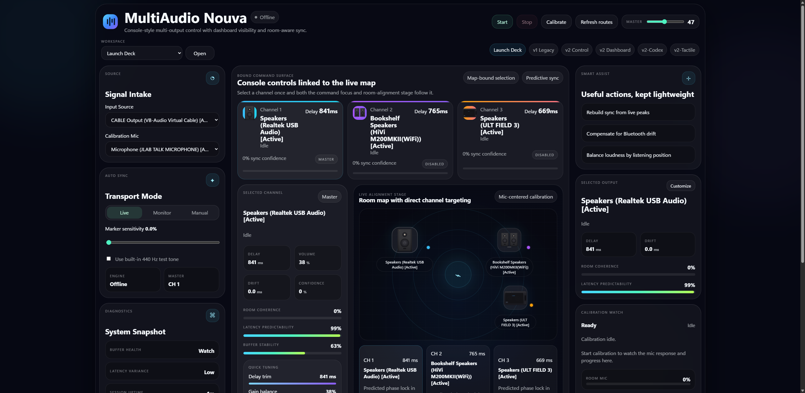
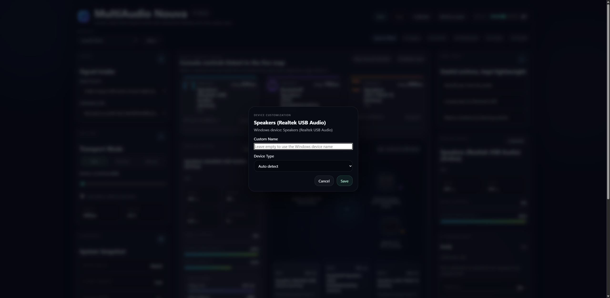
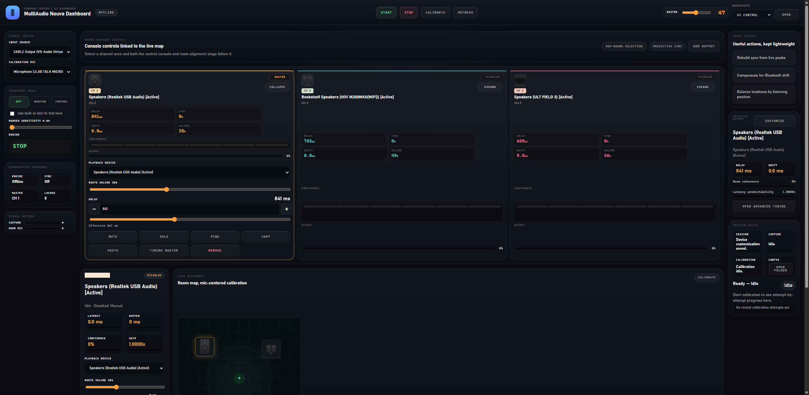
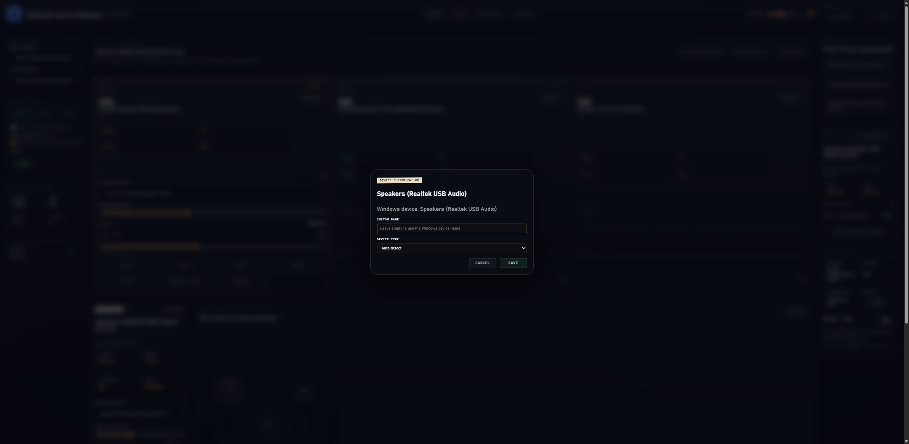

# MultiAudio Nouva

`MultiAudio Nouva` is a Windows-first multi-output audio routing and sync toolset. The original desktop host lives in `MultiOutputAudioTester`, and the current primary control surface lives in `WebUI` as a local browser app backed by the same audio engine.

## Current Route Map

The local WebUI now exposes multiple surfaces instead of a single route:

- `/`
  - `Launch Deck`
  - default route
  - command-center style overview and entry point
- `/v1/`
  - `v1 Legacy`
  - preserved earlier launch-deck/control surface
- `/v2/`
  - `v2 Control`
  - operator/control route
- `/v2-Dashboard/`
  - `v2 Dashboard`
  - dashboard-oriented room/map route
- `/v2-Codex/`
  - alternate route
- `/v2-Tactile/`
  - alternate route with the tactile console treatment

Every route now shares the same route-picker model so navigation no longer depends on accumulating one-off buttons.

## Changes Since `ae1c25e`

- Default route moved from legacy `v1` to the new `Launch Deck`.
- `v1` was preserved as its own legacy route instead of being overwritten.
- `v2 Control` and `v2 Dashboard` are now separate routes instead of sharing the same path.
- Added device-specific SVG icon support for speakers, bookshelf speakers, soundbars, portable speakers, and headphones.
- Added per-device customization:
  - custom speaker/display name
  - explicit device type override for icon selection
  - persisted in local config
- Added `Open Folder` actions where long config-path text was previously taking space.
- Added safe cleanup scripts for stale generated build output:
  - `scripts/cleanup-webui-temp.ps1`
  - `scripts/cleanup-wpf-obj.ps1`
- Added new verification screenshots for launch and dashboard device customization flows.

## Recent WebUI Screenshots

### Launch Deck



### Launch Deck Customize Dialog



### v2 Dashboard



### v2 Dashboard Customize Dialog



## Stack

- Windows desktop app
- C# / [.NET 8](https://dotnet.microsoft.com/en-us/download/dotnet/8.0)
- WPF desktop host
- [ASP.NET Core](https://dotnet.microsoft.com/en-us/apps/aspnet) local web host
- [NAudio](https://www.nuget.org/packages/NAudio/) for WASAPI capture, playback, metering, and sample-provider plumbing

## Project Layout

```text
MultiOutputAudioTester.sln
MultiOutputAudioTester/
  App.xaml
  MainWindow.xaml
  MultiOutputAudioTester.csproj
  Config/
  Helpers/
  Models/
  Services/
  ViewModels/
WebUI/
  WebUI.csproj
  Services/
  Models/
  wwwroot/
docs/
  screenshots/
scripts/
README.md
```

## Main Capabilities

- Enumerates Windows recording and playback devices.
- Captures one live input and fans it out to multiple playback routes.
- Provides per-route volume and delay control.
- Provides a global master volume.
- Supports route add/remove while stopped.
- Preserves calibration and live auto-sync support.
- Supports room-mic-assisted drift and alignment workflows.
- Saves local settings in `%LocalAppData%\MultiOutputAudioTester\config.json`.
- Supports per-device alias and icon customization in the WebUI.

## Device Customization

The WebUI now lets you customize playback-device presentation from the selected-output panel in supported routes.

What you can customize:

- `Custom Name`
- `Device Type`
  - `Auto detect`
  - `Speaker`
  - `Bookshelf speakers`
  - `Soundbar`
  - `Portable speaker`
  - `Headphones`

This data is appended to the local config file under `DeviceProfiles`.

Example:

```json
"DeviceProfiles": {
  "{device-id}": {
    "Alias": "Desk Monitors",
    "IconType": "bookshelf"
  }
}
```

## Dependencies

- Windows 10/11
- [.NET 8 SDK](https://dotnet.microsoft.com/en-us/download/dotnet/8.0) or newer SDK with the .NET 8 desktop runtime installed
- [Visual Studio 2022 Community](https://visualstudio.microsoft.com/vs/community/) or newer with `.NET desktop development`, or the `dotnet` CLI
- Internet access for the first NuGet restore so [NAudio](https://www.nuget.org/packages/NAudio/) can be downloaded
- Your existing capture setup:
  - Stereo Mix enabled in Windows if you want to capture system audio that way
  - or [VB-CABLE / Virtual Audio Cable](https://vb-audio.com/Cable/) already installed and routed on your machine

External dependency links:

- [.NET 8 SDK](https://dotnet.microsoft.com/en-us/download/dotnet/8.0)
- [Visual Studio 2022 Community](https://visualstudio.microsoft.com/vs/community/)
- [NAudio on NuGet](https://www.nuget.org/packages/NAudio/)
- [VB-CABLE / Virtual Audio Cable](https://vb-audio.com/Cable/)
- [ASP.NET Core](https://dotnet.microsoft.com/en-us/apps/aspnet)
- [Inno Setup 6](https://jrsoftware.org/isdl.php)

## Build And Run

From the repository root:

```powershell
dotnet restore .\MultiOutputAudioTester.sln
dotnet build .\MultiOutputAudioTester.sln
dotnet run --project .\WebUI\WebUI.csproj
```

If you want the old desktop host instead:

```powershell
dotnet run --project .\MultiOutputAudioTester\MultiOutputAudioTester.csproj
```

## Bluetooth Device Setup

Bluetooth outputs must be paired in Windows and actively connected before they will appear as usable playback targets in the app.

1. Pair the speaker or headphones in Windows Bluetooth settings.
2. Make sure the device shows as connected, not just paired.
3. Start the app only after the device is connected if you want it to appear immediately.
4. If the app is already open when you connect the device, click `Refresh Devices`.

If you are using virtual routing instead of a physical Bluetooth source, install [VB-CABLE](https://vb-audio.com/Cable/) first and make sure its endpoints appear in Windows before launch.

Paired device in Windows Bluetooth settings:


Connected device in Windows Bluetooth settings:


## Cleanup Scripts

Safe temporary/build cleanup:

```powershell
pwsh -ExecutionPolicy Bypass -File .\scripts\cleanup-webui-temp.ps1 -IncludeArtifactsCache
```

Safe WPF-generated obj cleanup:

```powershell
pwsh -ExecutionPolicy Bypass -File .\scripts\cleanup-wpf-obj.ps1
```

Include release WPF obj as well:

```powershell
pwsh -ExecutionPolicy Bypass -File .\scripts\cleanup-wpf-obj.ps1 -IncludeRelease
```

These scripts are intended to clean generated files only. They do not target `wwwroot`, `dist`, or source files.

## Config And Logs

Local config:

```text
%LocalAppData%\MultiOutputAudioTester\config.json
```

Session logs:

```text
%LocalAppData%\MultiOutputAudioTester\logs\
```

Calibration diagnostics:

```text
%LocalAppData%\MultiOutputAudioTester\diagnostics\
```
