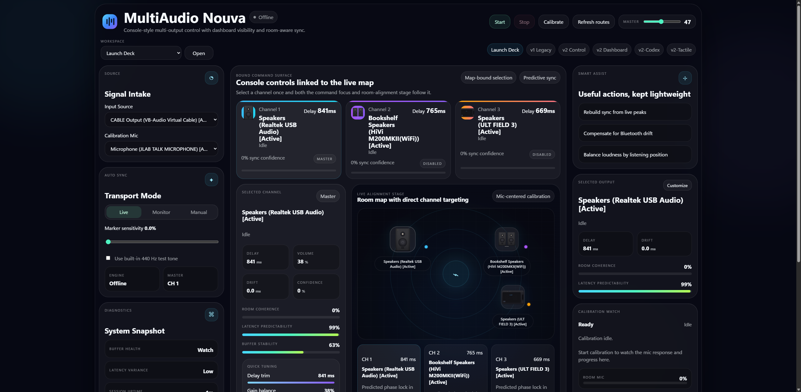
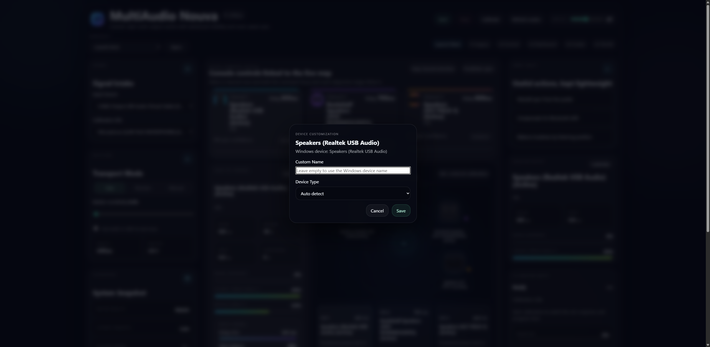
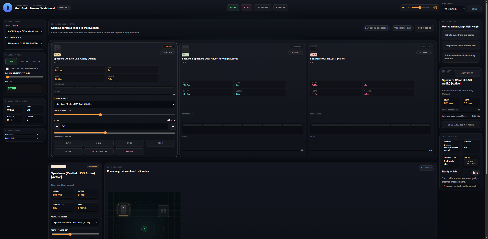
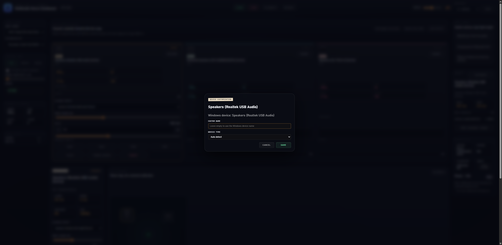

# MultiAudio Nouva

`MultiAudio Nouva` is a Windows-first multi-output audio routing and sync toolset. The original desktop host lives in `MultiOutputAudioTester`, and the current primary control surface lives in `WebUI` as a local browser app backed by the same audio engine.

## Astra is the default

Open `/` or `/astra/` for Astra: responsive source and output controls, live signal meters,
master and per-output gain, delay, mute/solo, device profiles, synchronization and calibration.
Connection loss disables commands; errors are shown in the control surface.

Previous pages are preserved under `WebUI/wwwroot/legacy/`. `/legacy/` is the archive index.
Versions v1, v2, and v3 remain available at `/legacy/v1/`, `/legacy/v2/`, and `/legacy/v3/`.
Their original URLs (including assets) continue to work. Launch Deck, Launch Neo, the
v2 variants, and the original root shell are also archived. All pages share one engine.

Backend improvements include ordered atomic config writes, pending-save flushing at shutdown,
validation before duplicate device assignments, finite-number and sync-mode checks, cross-origin
API protection, and proper 404 responses. Existing audio processing and desktop host are retained.

See [WebUI documentation](WebUI/README.md) for run instructions and API details.

## Historical WebUI Screenshots


### Launch Deck



### Launch Deck Customize Dialog



### v2 Dashboard



### v2 Dashboard Customize Dialog



## Stack

- Windows desktop app
- C# / [.NET 8](https://dotnet.microsoft.com/en-us/download/dotnet/8.0)
- WPF desktop host
- [ASP.NET Core](https://dotnet.microsoft.com/en-us/apps/aspnet) local web host
- [NAudio](https://www.nuget.org/packages/NAudio/) for WASAPI capture, playback, metering, and sample-provider plumbing

## Project Layout

```text
MultiOutputAudioTester.sln
MultiOutputAudioTester/
  App.xaml
  MainWindow.xaml
  MultiOutputAudioTester.csproj
  Config/
  Helpers/
  Models/
  Services/
  ViewModels/
WebUI/
  WebUI.csproj
  Services/
  Models/
  wwwroot/
docs/
  screenshots/
scripts/
README.md
```

## Main Capabilities

- Enumerates Windows recording and playback devices.
- Captures one live input and fans it out to multiple playback routes.
- Provides per-route volume and delay control.
- Provides a global master volume.
- Supports route add/remove while stopped.
- Preserves calibration and live auto-sync support.
- Supports room-mic-assisted drift and alignment workflows.
- Saves local settings in `%LocalAppData%\MultiOutputAudioTester\config.json`.
- Supports per-device alias and icon customization in the WebUI.

## Device Customization

The WebUI now lets you customize playback-device presentation from the selected-output panel in supported routes.

What you can customize:

- `Custom Name`
- `Device Type`
  - `Auto detect`
  - `Speaker`
  - `Bookshelf speakers`
  - `Soundbar`
  - `Portable speaker`
  - `Headphones`

This data is appended to the local config file under `DeviceProfiles`.

Example:

```json
"DeviceProfiles": {
  "{device-id}": {
    "Alias": "Desk Monitors",
    "IconType": "bookshelf"
  }
}
```

## Dependencies

- Windows 10/11
- [.NET 8 SDK](https://dotnet.microsoft.com/en-us/download/dotnet/8.0) or newer SDK with the .NET 8 desktop runtime installed
- [Visual Studio 2022 Community](https://visualstudio.microsoft.com/vs/community/) or newer with `.NET desktop development`, or the `dotnet` CLI
- Internet access for the first NuGet restore so [NAudio](https://www.nuget.org/packages/NAudio/) can be downloaded
- Your existing capture setup:
  - Stereo Mix enabled in Windows if you want to capture system audio that way
  - or [VB-CABLE / Virtual Audio Cable](https://vb-audio.com/Cable/) already installed and routed on your machine

External dependency links:

- [.NET 8 SDK](https://dotnet.microsoft.com/en-us/download/dotnet/8.0)
- [Visual Studio 2022 Community](https://visualstudio.microsoft.com/vs/community/)
- [NAudio on NuGet](https://www.nuget.org/packages/NAudio/)
- [VB-CABLE / Virtual Audio Cable](https://vb-audio.com/Cable/)
- [ASP.NET Core](https://dotnet.microsoft.com/en-us/apps/aspnet)
- [Inno Setup 6](https://jrsoftware.org/isdl.php)

## Build And Run

From the repository root:

```powershell
dotnet restore .\MultiOutputAudioTester.sln
dotnet build .\MultiOutputAudioTester.sln
dotnet run --project .\WebUI\WebUI.csproj
```

If you want the old desktop host instead:

```powershell
dotnet run --project .\MultiOutputAudioTester\MultiOutputAudioTester.csproj
```

## Bluetooth Device Setup

Bluetooth outputs must be paired in Windows and actively connected before they will appear as usable playback targets in the app.

1. Pair the speaker or headphones in Windows Bluetooth settings.
2. Make sure the device shows as connected, not just paired.
3. Start the app only after the device is connected if you want it to appear immediately.
4. If the app is already open when you connect the device, click `Refresh Devices`.

If you are using virtual routing instead of a physical Bluetooth source, install [VB-CABLE](https://vb-audio.com/Cable/) first and make sure its endpoints appear in Windows before launch.

Paired device in Windows Bluetooth settings:


Connected device in Windows Bluetooth settings:


## Cleanup Scripts

Safe temporary/build cleanup:

```powershell
pwsh -ExecutionPolicy Bypass -File .\scripts\cleanup-webui-temp.ps1 -IncludeArtifactsCache
```

Safe WPF-generated obj cleanup:

```powershell
pwsh -ExecutionPolicy Bypass -File .\scripts\cleanup-wpf-obj.ps1
```

Include release WPF obj as well:

```powershell
pwsh -ExecutionPolicy Bypass -File .\scripts\cleanup-wpf-obj.ps1 -IncludeRelease
```

These scripts are intended to clean generated files only. They do not target `wwwroot`, `dist`, or source files.

## Config And Logs

Local config:

```text
%LocalAppData%\MultiOutputAudioTester\config.json
```

Session logs:

```text
%LocalAppData%\MultiOutputAudioTester\logs\
```

Calibration diagnostics:

```text
%LocalAppData%\MultiOutputAudioTester\diagnostics\
```
